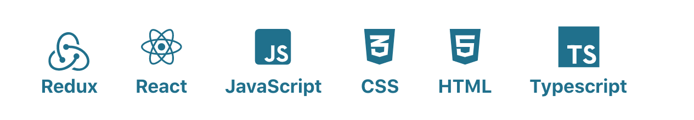

  <a href="mailto:facosta.marina@gmail.com">E-mail</a> •
  <a href="https://marinafroes.github.io/Portfolio/" target="_blank">Portfolio</a> •
  <a href="https://www.linkedin.com/in/marina-froes-a-costa/" target="_blank">Linkedin</a>

## 👋 Hello there, I am Marina

### About me
  * 👩‍💻 - Self-taught Frontend Developer
  * 🇧🇷 - Brazilian
  * 🇩🇪 - Living in Berlin
  * 🏠 - Architecture background
  * 📝 - I like lists

### Skills

### What I'm currently doing 

  * Learning Data Structures and Algorithms mainly with the resources bellow:
    * [CS50 Harvard Course](https://cs50.harvard.edu/x/2020/)
    * [Interview Cake Full Course](https://www.interviewcake.com/)

### My Repositories by category

  
<strong>My Projects</strong>

  | Title | Description | Technologies |
  |-------|-------------|--------------|
  | [Event Planner](https://github.com/MarinaFroes/Event_Planner) - IN PROGRESS | This web app to provide an easy way to plan events and invite friends sharing the costs with them | React + Redux + Typescript |
  | [My Portfolio](https://github.com/MarinaFroes/Portfolio) | My portfolio | React |
  | [My Reads](https://github.com/MarinaFroes/RDND-project1-MyReads)   | Udacity React Developer Nanodegree First Project| React |
  | [Would you rather game](https://github.com/MarinaFroes/RDND-project2-WouldYouRather)| Udacity React Developer Nanodegree Second Project| React + Redux |
  | [Mobile Flashcards](https://github.com/MarinaFroes/RDND-project3-mobile-flashcards)| Udacity React Developer Nanodegree Third Project| React Native |
  | [Tea Cozy Page](https://github.com/MarinaFroes/Tea-Cozy) | Originally created as part of the Codecademy Web Development Path using only HTML and CSS | React |
  | [Ravenous](https://github.com/MarinaFroes/Ravenous-Codecademy) | Yelp clone created as part of the Codecademy Web Development Path | React |
  | [Changing quotes app](https://github.com/MarinaFroes/Changing-quotes-app)| Really small react app to demonstrate state update in a specific interval| React |
  | [Portfolio](https://github.com/MarinaFroes/FEND-project1-Portfolio)   | Udacity Front-End Nanodegree First Project| HTML + CSS + JavaScript |
  | [Matching Game](https://github.com/MarinaFroes/FEND-project2-Matching-Game)   | Udacity Front-End Nanodegree Second Project| HTML + CSS + JavaScript |
  | [Arcade Game Clone](https://github.com/MarinaFroes/FEND-project3-Arcade-Game-Clone) | Udacity Front-End Nanodegree Third Project| HTML + CSS + JavaScript |
  | [Feed Reader Testing](https://github.com/MarinaFroes/FEND-project4-Feed-Reader-Testing) | Udacity Front-End Nanodegree Fourth Project| HTML + CSS + JavaScript + Jasmine |
  | [Restaurant Review App](https://github.com/MarinaFroes/FEND-project5-Restaurant-Review-App) | Udacity Front-End Nanodegree Fifth Project| HTML + CSS + JavaScript + ServiceWorker |
  | [Harry Potter Quiz](https://github.com/MarinaFroes/Harry-Potter-Quiz) | Quiz to test your knowledge about Harry Potter | HTML + CSS + JavaScript |

  
<strong>Tutorials World</strong>

  | Title | Reference |
  |-------|-----------|
  | [React TDD Tutorial](https://github.com/MarinaFroes/react-tdd-tutorial) - IN PROGRESS | By [CodingItWrong](https://www.youtube.com/watch?v=0aAdglT39go&list=PLXXnezSEtvNMlfJFd1Z2wilxymcOaVl9Q&index=2&t=0s) |
  | [Tailwind CSS Crash Course](https://github.com/MarinaFroes/tailwind-basic-tutorial)| By [Traversy Media](https://www.youtube.com/watch?v=UBOj6rqRUME)|
  |[MERN Exercise Tracker](https://github.com/MarinaFroes/MERN-exercise-tracker-tutorial)| By [Freecodecamp](https://www.youtube.com/watch?v=7CqJlxBYj-M&t=2416s)|
  | [React Testing Library](https://github.com/MarinaFroes/react-testing-ilbrary-tutorial) | By [Techsith](https://www.youtube.com/watch?v=3e1GHCA3GP0)|
  | [React + Redux](https://github.com/MarinaFroes/redux-react-example) | By [Traversy Media](https://www.youtube.com/watch?v=93p3LxR9xfM)|
  | [Automation with Python](https://github.com/MarinaFroes/automation-with-python-tutorial) | By [Programming with Mosh](https://www.youtube.com/watch?v=_uQrJ0TkZlc) |
  | [Pokemon Search Tutorial](https://github.com/MarinaFroes/pokemon-search-tutorial) | By [Classsed](https://www.youtube.com/watch?v=0_C2X1yRRac) |
  | [Check Weather App with React](https://github.com/MarinaFroes/Check-Weather) | By [Hamza Mirza](https://www.youtube.com/watch?v=204C9yNeOYI&t=1857s) |
  | [Todo App with Vanilla JS](https://github.com/MarinaFroes/Todo-App) | By [Burak Tilek](https://www.youtube.com/watch?v=bFbXyPlXmhM) |
  | [Tic Tac Tow with React](https://github.com/MarinaFroes/Tic-Tac-Toe) | By [ReactJs](https://reactjs.org/tutorial/tutorial.html) |
  | [Simple React Calculator App](https://github.com/MarinaFroes/React-Calculator) | By [ Krissanawat Kaewsanmuang](https://medium.com/@kris101/create-a-simple-calculator-app-in-react-9fd645bb21ac) |

  
<strong>Challenges</strong>

  | Title | Description |
  |-------|-----------|
  | [Chatbot challenge](https://github.com/MarinaFroes/chatbot-codeworks-challenge)|Chatbot created with HTML, CSS, JavaScript and jQuery for the Codeworks Coding Assessment|
  |[Four card feature Section](https://github.com/MarinaFroes/frontend-mentor-four-card-feature-section)| [Frontend Mentor Challenge](https://www.frontendmentor.io/challenges/four-card-feature-section-weK1eFYK) to practice HTML + CSS|
  |[Huddle Landing Page](https://github.com/MarinaFroes/frontend-mentor-huddle-landing-page)| [Frontend Mentor Challenge](https://www.frontendmentor.io/challenges/huddle-landing-page-with-alternating-feature-blocks-5ca5f5981e82137ec91a5100)  to practice HTML + CSS|
  |[Coding Bootcamp Testimonial Slider](https://github.com/MarinaFroes/frontend-mentor-testimonial)|[Frontend Mentor Challenge](https://www.frontendmentor.io/challenges/coding-bootcamp-testimonials-slider-4FNyLA8JL/intro) to practice HTML + CSS|
  |[Single Price Grid Component](https://github.com/MarinaFroes/frontend-mentor-single-price-grid)|[Frontend Mentor Challenge](https://www.frontendmentor.io/challenges/single-price-grid-component-5ce41129d0ff452fec5abbbc) to practice HTML + CSS|
  |[Fylo landing page with dark theme](https://github.com/MarinaFroes/frontend-mentor-fylo-dark-theme)|[Frontend Mentor Challenge](https://www.frontendmentor.io/challenges/fylo-dark-theme-landing-page-5ca5f2d21e82137ec91a50fd) to practice HTML + CSS|
  | [Giphy Gallery with JS](https://github.com/MarinaFroes/giphy-gallery-JS) | Created for an internship coding challenge |
  | [Giphy Gallery with React](https://github.com/MarinaFroes/giphy-gallery-react) | Created for an internship coding challenge |
  | [Interplay of components](https://github.com/MarinaFroes/interplay-of-components) | Created for an internship coding challenge using React + Redux + Typescript + Jest + Enzyme |

  
<strong>Some day I'll finish them</strong>

  | Title | Description |
  |-------|-------------|
  | [Pizza Gallery](https://github.com/MarinaFroes/pizza-gallery)| Project created to learn webpack|
  | [React Quiz](https://github.com/MarinaFroes/React-quiz)| React quiz|
  | [Food Critic App](https://github.com/MarinaFroes/foodcritic-app) | Restaurant Review App |
  | [React Todo App](https://github.com/MarinaFroes/react-todo-app) | Todo app |
  | [React Form](https://github.com/MarinaFroes/react-form) | Form |

